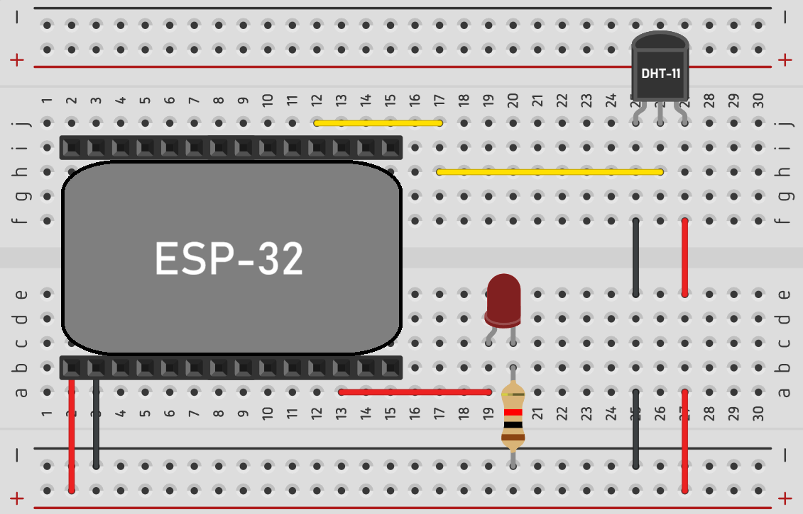

# ESP32 MQTT Control

[](https://docs.espressif.com/projects/esp-idf/en/latest/esp32/get-started/)  
[](https://www.docker.com/)  
[](https://mqtt.org/)  
[](https://www.espressif.com/en/products/socs/esp32)  

Este proyecto implementa una arquitectura IoT sencilla basada en **ESP32**, un sensor **DHT11** de temperatura y humedad, y una **interfaz web** que permite visualizar los datos y controlar una luz de manera remota mediante **MQTT**.  
La comunicación entre el ESP32 y la web se realiza a través de un **broker MQTT**, y tanto la web como el broker se despliegan con **Docker** para facilitar su configuración y portabilidad.

---

## 🚀 Arquitectura del Proyecto

- **ESP32**: Obtiene los datos de temperatura y humedad mediante el sensor **DHT11** y se comunica vía **MQTT**.  
- **MQTT Broker (Eclipse Mosquitto)**: Actúa como intermediario entre el ESP32 y la aplicación web.  
- **Dashboard Web**: Desplegado en Docker, permite:
  - Visualizar los datos de temperatura y humedad.
  - Encender y apagar una luz enviando comandos al ESP32.  

---

## 🛠️ Requisitos

- **Hardware**:
  - ESP32
  - Sensor DHT11
  - LED o relay para controlar la luz

- **Software**:
  - [ESP-IDF](https://docs.espressif.com/projects/esp-idf/en/latest/esp32/get-started/)
  - [Docker](https://docs.docker.com/get-docker/)
  - [Docker Compose](https://docs.docker.com/compose/)

---

## ⚙️ Instalación y Uso

1. Clonar el repositorio
   ```bash
   git clone [https://github.com/usuario/ESP32-MQTT-Control.git](https://github.com/AlejandroMB02/ESP32-MQTT-Control)
   cd ESP32-MQTT-Control/ESP32
2. Credenciales
  - Ajustar las credenciales de WiFi.
  - Configurar la IP/host del broker MQTT.
3. Compilar y flashear el ESP32
  ```bash
  idf.py build
  idf.py -p /dev/ttyUSB0 flash monitor
  ```



4. Levantar el Broker MQTT y el Dashboard
  - Desde la carpeta principal:
  ```bash
  cd ./Dashboard
  docker-compose up -d
  ```
  - Desde la carpeta principal:
  ```bash
  cd ./MQTT_Broker
  docker-compose up -d
  ```
  Esto iniciará:
  Mosquitto (broker MQTT)
  Web Dashboard (interfaz web para visualizar/controlar)

👉 Aquí puedes añadir una captura de pantalla del dashboard.

## 📡 Comunicación MQTT

### Tópicos publicados por el ESP32:

esp32/temperature → valor de temperatura en °C
esp32/humidity → valor de humedad en %

### Tópicos suscritos por el ESP32:

esp32/light → recibe "ON" o "OFF" para controlar la luz

## 🌐 Flujo de Funcionamiento

1. El ESP32 lee los datos del sensor DHT11.
2. Publica temperatura y humedad en los tópicos MQTT correspondientes.
3. El Dashboard se suscribe a estos tópicos y muestra los valores en tiempo real.
4. Cuando el usuario interactúa con la web (encender/apagar luz), se publica un mensaje MQTT que el ESP32 recibe y ejecuta.


